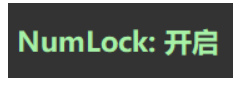
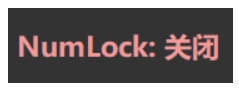

在[SunHubert/KeyboardIndicator](https://github.com/SunHubert/KeyboardIndicator)基础上修改,
添加了以下功能：
- 添加了NumLock状态指示窗口，按下之后出现一个弹窗显示NumLock状态，并显示一段时间后自动关闭
- 菜单项添加了“开机启动”选项，可选择是否开机启动

示意图：

**copy from [【原创】小键盘NumLock状态指示工具](http://www.cnblogs.com/laozuan/p/3375618.html)**
*****

Status Indicator for **NumLock** and **CapsLock**

Changing the value can change the number of icons displayed in the system tray .If you set NumLock to N and CapsLock to N, then NumLock Indicator will work.

You can ***double-click*** any icon to close this program.

*****

>* yuzhiboxiu@163.com # 2013/10/30 12:44
>
>能否设置成右键退出？左键点击也退出的话，太容易误操作了。
>
>
>* root # 2013/10/23 10:39
>
>有木有caps lock 和num lock一起的。。。
>
>
>* EllisLi # 2013/11/01 00:16
>
>怎么能让它不出现在Alt+Tab里

**原文中提到如上三点都已经有个人想法的实现：**
* 第一点：个人也有此困扰。故改成双击关闭。
* 第二点：已经实现，可使用配置文件自由设定（如果都设置为N，则 NumLock 依旧会生效）。
* 第三点：已经实现。